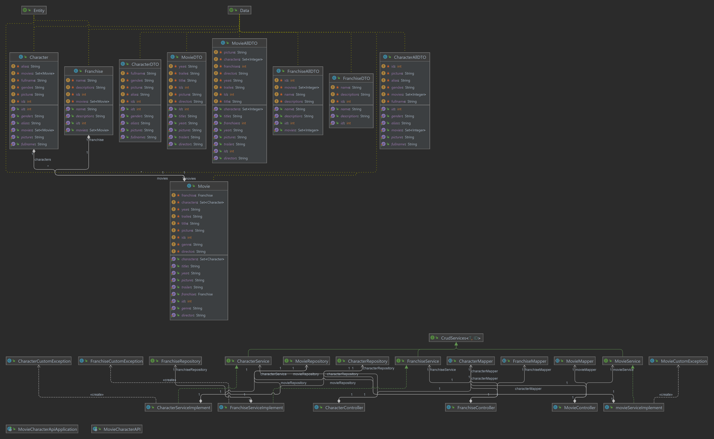

## Movie Characters API

The application is created in Spring web and comprise of a database made in PostresSQL through hibernate. 

This  is a API for Movies, franchise and character. 
We can do all the Crud operation and checking for character inside the movies API.

The database will store information about characters, movies
they appear in, and the franchises these movies belong to.

## Author 

Name Mostafa Mohammedi 

Name Mebrahtu Gebremedhin

